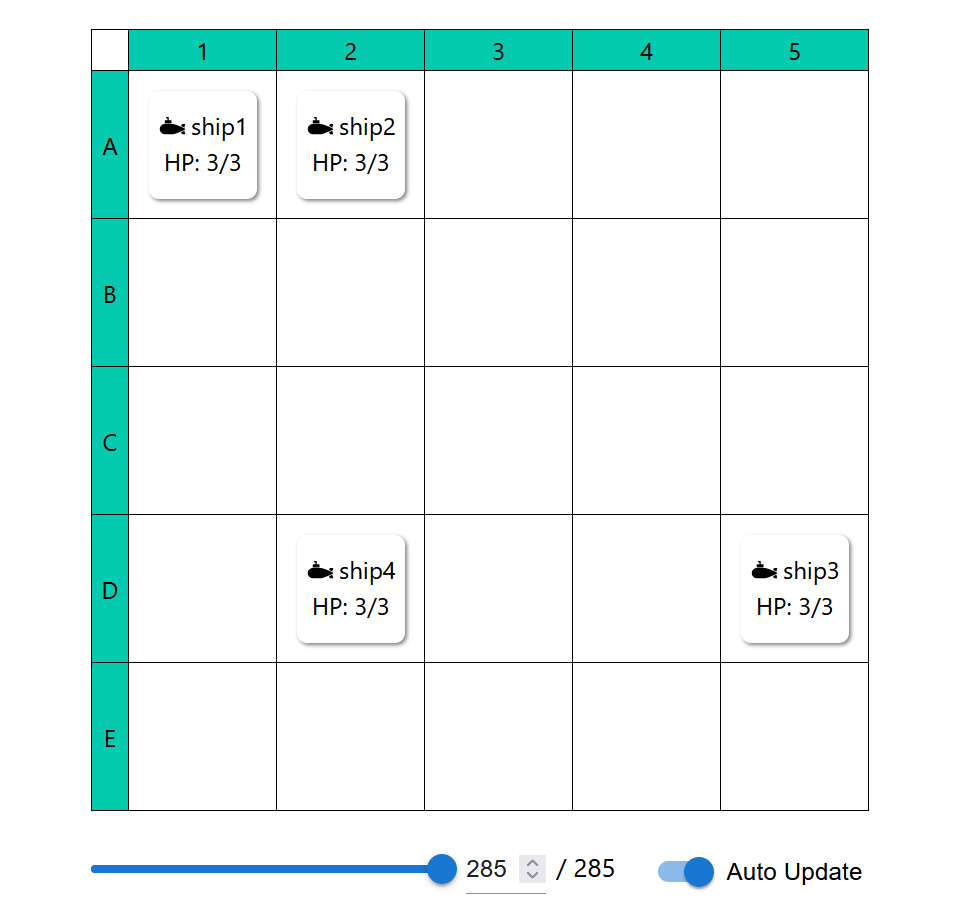

# battle-ship-viewer



## About

某潜水艦ゲーム用補助ビューワです．Java前提．

## Usage

### 潜水艦ゲーム側
詳細はSample.java説明で
1. あらかじめmainメソッドがあるjavaファイルと同じ場所にcomフォルダを配置しておく．
1. BattleShipViwerクラスのインスタンスを作成
1. ThreadクラスのコンストラクタにBattleShipViwerクラスのインスタンスを渡してインスタンスを作成
1. Threadクラスのインスタンスでstartメソッドを実行
1. 潜水艦位置更新ごとにBattleShipBoardインスタンスにShipインスタンスを登録してBattleShipViwerにBattleShipBoardインスタンスを渡す

以下4を繰り返し．

```
├─com
│  └─github
│      └─Tsuyopon1067
│          └─BattleShipViwer
├─Hogehoge1.java
├─Hogehoge2.java
├─Hogehoge3.java
├─︙
```

### Webアプリ側
1. HttpServer.javaをbuildディレクトリ内（index.htmlと同じ場所）に配置（必要であればReactアプリケーションをビルド）
1. HttpServer.javaを起動
1. ブラウザで指定アドレスにアクセス(デフォルトでは[http://localhost:50001/index.html](http://localhost:50001/index.html))
```
build
├─index.html とかいろいろ
└─HttpServer.java
```

```
javac HttpServer.java
↓必要であれば UTF8でコンパイル
javac -encoding UTF-8 HttpServer.java

java HttpServer
```

### Sample.java説明
#### final変数
```
static final int HEIGHT = 5; 盤面の縦サイズ
static final int WIDTH = 5; 盤面の横サイズ
static final int MAX_HP = 3; 潜水艦の最大HP
static final int FREQUENCY_MS = 1000; ランダム配置の更新頻度[ms]（サンプル用．意識しなくて良い．）
static final int PORT = 50000; ポート番号（Webアプリで指定済みなので変更は非推奨）
static final String CLIENT_URL = "http://localhost:50001"; クラアントURL．HttpServer.javaで開くポートを指定するので変更不要．
```

#### サーバ起動処理
以下3行をコピペでサーバが起動する．ここから先の処理はご自由に．
```
BattleShipViwer battleShipViwer = new BattleShipViwer(PORT, CLIENT_URL);
Thread serverThread = new Thread(battleShipViwer);
serverThread.start();
```

#### whileプロック
FREQUENCY_MS[ms]ごとに盤面の登録をしているだけ．
registerクラスで登録済み盤面情報（board）を受け取り，battleShipViwerに登録している．
registerBoardメソッドを実行すると，WebアプリにHTTPレスポンスが送信される．
```
while (true) {
    try {
        Thread.sleep(FREQUENCY_MS);
    } catch (InterruptedException e) {
        e.printStackTrace();
        break;
    }
    // 盤面データの登録
    BattleShipBoard board = register();
    battleShipViwer.registerBoard(board);
}
```

#### 登録処理（registerメソッド）
以下で盤面変数が定義できる．
```
BattleShipBoard board = new BattleShipBoard(HEIGHT, WIDTH);
```
Shipクラスのコンストラクタは，名前（なんでも），最大HP，現在HP
```
Ship ship2 = new Ship("ship2", MAX_HP, 1);
```
潜水艦の位置登録はsetShipメソッドを使う．引数はShipインスタンス，y座標，x座標．
座標は0開始．ビューワの1開始とは異なることに注意．
```
board.setShip(ship1, yPos, xPos);
```

## Execution Environment

Java環境ならどこでも．

-   Windows
-   Mac
-   Linux

## Download

まだ．

## Framework, Language

-   openjdk v11.0.16.1
-   React.js v18.2.0
-   TypeScript v4.6.4
-   Node.js v20.10.0
